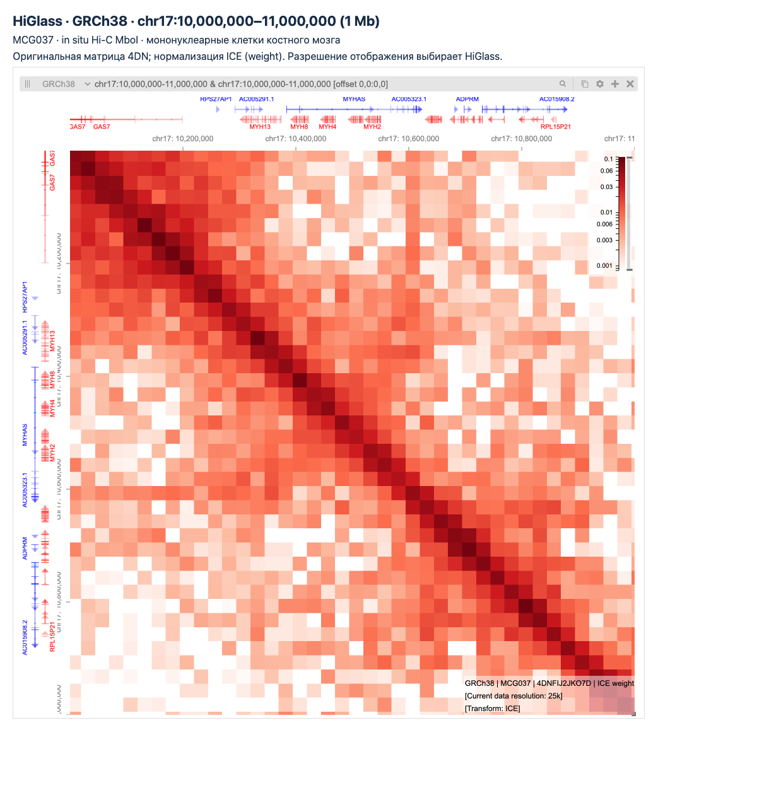
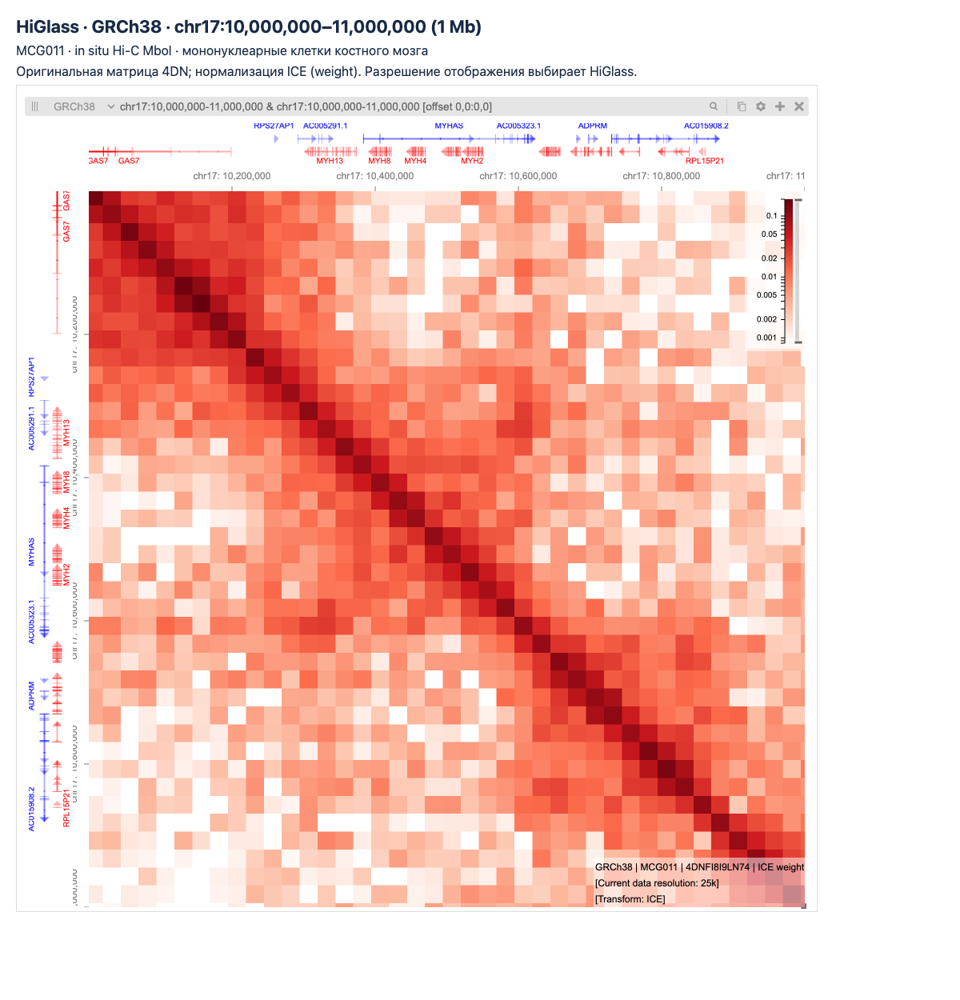
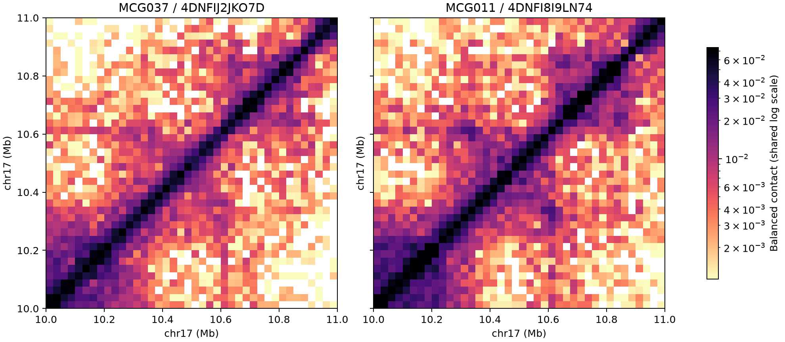
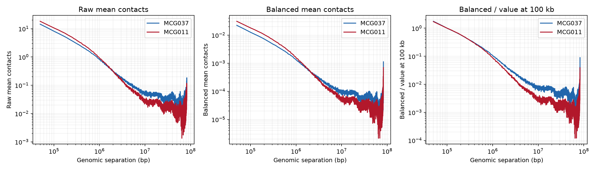
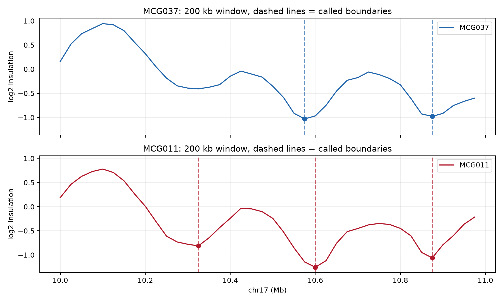
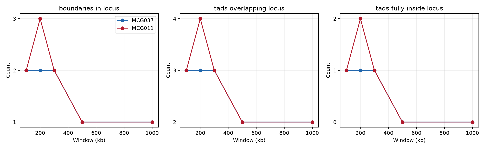
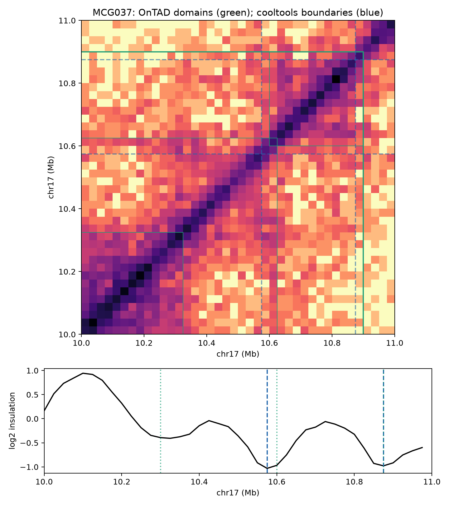
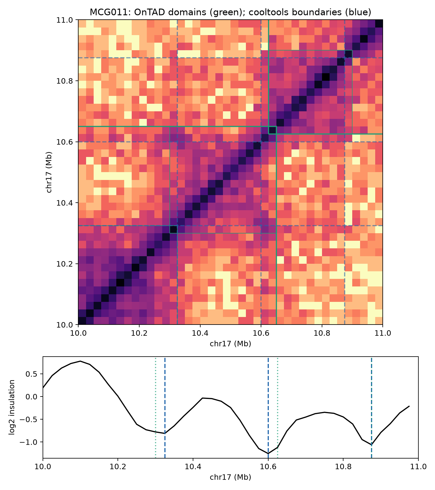

# ДЗ №4. Сравнение двух Hi-C матриц

В работе сравниваются два образца — MCG037 и MCG011. Основной вопрос: насколько похожа организация хроматина на одном и том же участке у разных доноров и как результат поиска ТАДов зависит от выбранного метода и размера окна.

Для подробного анализа взят участок **chr17:10,000,000–11,000,000** длиной 1 Мб. Разрешение матриц — **25 кб**, сборка генома — **GRCh38**.

## 1. Данные

Оба набора получены методом in situ Hi-C с ферментом MboI. Это мононуклеарные клетки костного мозга двух пациентов с B-ALL.

| Образец | Файл 4DN | Эксперимент |
| --- | --- | --- |
| MCG037 | [4DNFIJ2JKO7D](https://data.4dnucleome.org/files-processed/4DNFIJ2JKO7D/) | [4DNES8BK27SC](https://data.4dnucleome.org/experiment-set-replicates/4DNES8BK27SC/) |
| MCG011 | [4DNFI8I9LN74](https://data.4dnucleome.org/files-processed/4DNFI8I9LN74/) | [4DNES2DB4F2D](https://data.4dnucleome.org/experiment-set-replicates/4DNES2DB4F2D/) |

В названиях файлов на портале встречается слово *Monocytes*, но в описаниях экспериментов указаны *mononuclear cells*. Поэтому здесь используется более общее название — мононуклеарные клетки. Образцы принадлежат разным донорам и не образуют пару «контроль — лечение».

Исходные `.mcool` загружаются скриптом `download_data.py`; ссылки и контрольные суммы находятся в [data/sources.json](../data/sources.json).

## 2. Выбранный участок в HiGlass

Ниже показан один и тот же участок chr17 в HiGlass. Для обоих образцов использованы нормировка ICE и разрешение 25 кб.





На обеих картах наиболее сильные контакты сосредоточены возле диагонали: соседние участки хромосомы контактируют чаще, чем удалённые. Общий рисунок похож, однако по одной тепловой карте трудно уверенно определить, совпадают ли границы доменов. Для этого далее рассчитан insulation score.

## 3. Структура матриц и балансировка

Матрицы открыты на разрешении 25 кб через `cooler.Cooler`. Их основные характеристики получены из `c.info`:

| Атрибут | MCG037 | MCG011 |
| --- | --- | --- |
| bin-size | 25000 | 25000 |
| nbins | 123541 | 123541 |
| nchroms | 24 | 24 |
| nnz | 24379490 | 23303355 |
| sum | 39749863 | 47765539 |
| storage-mode | symmetric-upper | symmetric-upper |
| genome-assembly | unknown | unknown |

Здесь `nbins` — число бинов во всей матрице, `nnz` — число ненулевых записей, а `sum` — сумма исходных контактов. У MCG011 сумма контактов выше, хотя ненулевых записей немного меньше. Значение `genome-assembly` внутри файлов не заполнено; сборка GRCh38 указана в карточках 4DN. Полные атрибуты сохранены в [summary.json](../results/summary.json).

У обоих образцов таблица `bins` содержит столбцы `chrom`, `start`, `end`, `KR`, `VC`, `VC_SQRT`, `weight`. Первые три задают координаты бина, остальные относятся к нормировке. В анализе используется `weight` — мультипликативный вес ICE. В выбранном локусе 40 бинов, и у всех есть конечные значения этого веса.

Таблица `pixels` содержит `bin1_id`, `bin2_id` и `count`. **Поле `count` хранит исходное, несбалансированное число контактов.** Сбалансированное значение рассчитывается отдельно:

```text
balanced = count × weight1 × weight2
```

Внутрихромосомная матрица для выбранного участка получена так:

```python
c.matrix(balance="weight").fetch("chr17:10000000-11000000")
```

Для таблицы контактов использованы параметры `as_pixels=True, join=True`: они позволяют получить координаты обоих бинов вместе с `count` и `balanced`. Например, первые строки таблицы MCG037 выглядят так:

| start1 | start2 | count (raw) | balanced |
| --- | --- | --- | --- |
| 10000000 | 10000000 | 62 | 0.0723603 |
| 10000000 | 10025000 | 68 | 0.0678023 |
| 10000000 | 10050000 | 31 | 0.0357407 |
| 10000000 | 10075000 | 23 | 0.0244075 |

Таблица также выгружена из командной строки:

```bash
python -m cooler dump --header --join --balanced \
  --range chr17:10000000-11000000 \
  data/4DNFIJ2JKO7D.mcool::/resolutions/25000
```

Для MCG011 выполнена та же команда с файлом `4DNFI8I9LN74.mcool`. Результаты находятся в `*_cooler_dump_balanced.tsv`. Несмотря на название, эти таблицы содержат оба значения: исходное `count` и нормированное `balanced`.

Матрицы хранятся в режиме `symmetric-upper`, поэтому в таблицах представлен только верхний треугольник. Нулевые контакты в разреженной таблице явно не записаны. При этом отсутствие веса балансировки означало бы неопределённое значение (`NaN`), а не нулевое число контактов.



## 4. Как частота контактов зависит от расстояния

Для всей chr17 с помощью `cooltools.expected_cis` рассчитано среднее число контактов между бинами на каждом геномном расстоянии. Первые две диагонали исключены (`ignore_diags=2`), поэтому кривые начинаются с 50 кб. Обе оси графиков логарифмические.

Исходные и сбалансированные контакты рассчитаны отдельно. Для raw использован `clr_weight_name=None`: сумма контактов делится на общее число пар бинов (`n_total`), включая пары с нулевыми контактами. Для balanced учитываются только пары с доступными весами, а знаменатель — `n_valid`.

| Образец | Raw mean при 100 кб | Balanced mean при 100 кб | Наклон log–log (50 кб–2 Мб) |
| --- | --- | --- | --- |
| MCG037 | 8.15359 | 0.012593 | -1.082 |
| MCG011 | 10.6408 | 0.0180217 | -1.208 |

У обоих образцов частота контактов снижается с расстоянием. При 100 кб значение MCG011 выше значения MCG037 в 1.305 раза для raw и в 1.431 раза для balanced. Само по себе это ещё не говорит о более тесной упаковке хроматина: на уровень контактов влияют глубина секвенирования и масштаб нормировочных весов.

Чтобы сравнить именно форму кривых, на третьей панели каждую из них дополнительно разделили на её значение при 100 кб. Формы близки: корреляция `log10` сбалансированных значений в диапазоне 50 кб–2 Мб составляет **0.9990**. При этом у MCG011 спад немного круче: наклон равен −1.208 против −1.082 у MCG037. Дальний хвост кривых заметно шумнее, поскольку для больших расстояний остаётся меньше пар бинов.



## 5. Insulation score и границы ТАДов

Insulation score рассчитан на всей chr17, после чего выделен участок 10–11 Мб. Это позволяет не обрезать окна на краях выбранного локуса. Использованы окна 100, 200, 300, 500 и 1000 кб; для основного сравнения взято окно **200 кб**.

Параметры расчёта: `ignore_diags=2`, `min_frac_valid_pixels=0.66`, `threshold="Li"`, `clr_weight_name="weight"`.

Insulation score характеризует контакты между областями по обе стороны от рассматриваемой позиции. Локальный минимум указывает на возможную границу: контактов через неё меньше, чем в соседних участках. В cooltools сила границы (`boundary_strength`) определяется выраженностью этого минимума — его *prominence*. Значимые границы выбираются по порогу Li, отдельно для каждого образца и окна.

| Образец | Bin границы, bp | log2 insulation | boundary_strength |
| --- | --- | --- | --- |
| MCG037 | 10,575,000–10,600,000 | -1.0303 | 0.9712 |
| MCG037 | 10,875,000–10,900,000 | -0.9780 | 0.4726 |
| MCG011 | 10,325,000–10,350,000 | -0.8117 | 0.7773 |
| MCG011 | 10,600,000–10,625,000 | -1.2548 | 1.2526 |
| MCG011 | 10,875,000–10,900,000 | -1.0614 | 0.7141 |

При окне 200 кб у MCG037 найдены две границы, у MCG011 — три. Две пары совпадают с точностью до одного бина (25 кб): около 10.6 и 10.875 Мб. Главное различие — дополнительная граница у MCG011 около **10.325 Мб**. В результате этот образец имеет более дробное разделение доменов в начале выбранного участка.

Общие границы у MCG011 также имеют более высокие значения `boundary_strength`. Однако на отбор влияет и автоматический порог, поэтому различие списков границ нельзя объяснять только биологией.



## 6. BED-файлы

Границы при окне 200 кб сохранены в двух файлах:

- [MCG037_boundaries.bed](../results/MCG037_boundaries.bed);
- [MCG011_boundaries.bed](../results/MCG011_boundaries.bed).

Поля: `chrom`, `start`, `end`, `name`, `score`, `strand`. Координаты 0-based, интервалы полуоткрытые: `[start, end)`.

Для поля `score` сила границы приведена к целому числу от 0 до 1000:

```text
score = round(1000 × boundary_strength / (1 + boundary_strength))
```

Одинаковое преобразование применено к обоим образцам. Исходные значения `boundary_strength_200000` находятся в `*_insulation_locus.tsv`. Значение `strand` равно `.`, поскольку направление для границы не задано.

## 7. Влияние размера окна на число ТАДов

ТАДы определены как интервалы между соседними значимыми границами. Интервалы, проходящие через плохие бины или позиции с неопределённым insulation score, исключены. Края локуса сами по себе границами не считаются.

Часть доменов выходит за пределы выбранного участка. Поэтому в таблице отдельно приведены число ТАДов, пересекающих локус, и число ТАДов, полностью находящихся внутри него.

| Образец | Окно, кб | Границы | ТАДы пересекают | ТАДы внутри |
| --- | --- | --- | --- | --- |
| MCG037 | 100 | 2 | 3 | 1 |
| MCG037 | 200 | 2 | 3 | 1 |
| MCG037 | 300 | 2 | 3 | 1 |
| MCG037 | 500 | 1 | 2 | 0 |
| MCG037 | 1000 | 1 | 2 | 0 |
| MCG011 | 100 | 2 | 3 | 1 |
| MCG011 | 200 | 3 | 4 | 2 |
| MCG011 | 300 | 2 | 3 | 1 |
| MCG011 | 500 | 1 | 2 | 0 |
| MCG011 | 1000 | 1 | 2 | 0 |

У MCG037 результат устойчив при окнах 100–300 кб: локус пересекают три ТАДа. При 500 и 1000 кб их остаётся два. У MCG011 зависимость не вполне монотонна: число доменов сначала увеличивается с трёх до четырёх при окне 200 кб, затем снова снижается.

Таким образом, при больших окнах в обоих образцах выделяется меньше доменов. Более крупное окно меняет масштаб оценки контактов и выраженность минимумов; вместе с порогом Li это может как убирать отдельные границы, так и добавлять их. Поэтому ожидать строго монотонной зависимости для каждого шага не стоит.

Во всех пяти расчётах insulation score определён для всех 40 бинов локуса. Значит, уменьшение числа ТАДов здесь не связано с потерей части профиля. Координаты доменов сохранены в `*_tads_WINDOW.tsv`, сводные числа — в [window_counts.tsv](../results/window_counts.tsv).



## 8. Сравнение с OnTAD

Для сравнения использован **OnTAD**, который ищет вложенные домены с помощью многошкального поиска границ и динамического программирования. Ему передана контактная матрица, без использования результатов cooltools.

На вход подана исходная матрица участка chr17:7.5–13.5 Мб — 240 × 240 бинов по 25 кб. Дополнительный контекст нужен, чтобы границы участка 10–11 Мб не совпадали с краями входной матрицы. Параметры: `penalty=0.1`, `minsz=3` (75 кб), `maxsz=80` (2 Мб), `ldiff=1.96`, `lsize=5`. Версия OnTAD закреплена коммитом `dc36df93598bd2dce92fe6e1e97425a60c73178b`.

OnTAD получает raw-контакты и сам выполняет стандартизацию по геномному расстоянию. Поэтому отличия от cooltools связаны не только с алгоритмом, но и с нормировкой. Для сравнения взяты внешний уровень доменов (`level1`) и все уровни вложенности (`all_levels`).

Результаты сохранены в `.tad` и `*_ontad_domains.tsv`. В исходном формате OnTAD начало и конец — включённые индексы бинов, отсчитываемые от единицы. Они переведены в геномные координаты по формулам:

```text
start_bp = 7,500,000 + (start_bin − 1) × 25,000
end_bp   = 7,500,000 + end_bin × 25,000
```

Служебный корневой интервал `level=0` исключён. При сопоставлении границ оба индекса привязаны к началу соответствующего бина, а общие граничные бины соседних доменов учитываются один раз.

Границы сопоставлены с допуском **±25 кб**. Каждая граница участвует не более чем в одной паре. Для оценки совпадения использован индекс Жаккара:

```text
Jaccard = matched / (N_cooltools + N_OnTAD − matched)
```

| Образец / OnTAD | Границы cooltools / OnTAD | Совпали 1:1 | Доли совпадений (cooltools / OnTAD) | Boundary Jaccard |
| --- | --- | --- | --- | --- |
| MCG037 / level1 | 2 / 1 | 1 | 0.500 / 1.000 | 0.500 |
| MCG037 / all_levels | 2 / 3 | 2 | 1.000 / 0.667 | 0.667 |
| MCG011 / level1 | 3 / 1 | 1 | 0.333 / 1.000 | 0.333 |
| MCG011 / all_levels | 3 / 3 | 3 | 1.000 / 1.000 | 1.000 |

Если учитывать все уровни OnTAD, для каждой границы cooltools находится соответствующая граница в пределах 25 кб. У MCG037 OnTAD дополнительно выделяет ещё одну границу. У MCG011 наборы совпадают полностью в пределах принятого допуска. Только внешний уровень OnTAD даёт гораздо меньше совпадений: часть границ cooltools относится к вложенным доменам.

Для сравнения самих доменов рассчитан IoU — отношение длины пересечения интервалов к длине их объединения. Для каждого домена cooltools выбран наиболее похожий домен OnTAD. Сравнивались полные координаты, без обрезания по краям локуса.

| Образец | Уровни OnTAD | Средний best IoU доменов |
| --- | --- | --- |
| MCG011 | all_levels | 0.725 |
| MCG011 | level1 | 0.292 |
| MCG037 | all_levels | 0.588 |
| MCG037 | level1 | 0.265 |

Учёт вложенных доменов улучшает совпадение и по IoU. При этом даже совпадение всех границ внутри локуса не означает полного совпадения доменов: их вторые границы могут находиться за его пределами. Это видно на MCG011, где Jaccard границ равен 1, а средний лучший IoU доменов — 0.725.





## 9. Выводы

Два образца имеют похожую зависимость частоты контактов от расстояния, но не полностью совпадают по локальной доменной структуре. При окне insulation 200 кб у MCG037 найдены две границы, у MCG011 — три; дополнительная граница второго образца расположена около 10.325 Мб.

Результат заметно зависит от масштаба анализа. При переходе к окнам 500–1000 кб оба образца дают по два ТАДа, пересекающих локус. OnTAD находит соответствия всем границам cooltools, если учитывать вложенные домены, но сами интервалы совпадают лишь частично.

Эти наблюдения относятся к одному локусу и двум донорам. Без контрольной группы и повторных измерений нельзя связать различия с заболеванием или оценить их статистическую значимость. Совпадение двух алгоритмов также не является независимым биологическим подтверждением: оба анализируют одни и те же контактные данные.

## Источники

- [Cooler: API](https://cooler.readthedocs.io/en/latest/api.html) и [командная строка](https://cooler.readthedocs.io/en/latest/cli.html).
- [Cooltools: insulation score и границы](https://cooltools.readthedocs.io/en/latest/notebooks/insulation_and_boundaries.html).
- [Cooltools: контакты и расстояние](https://cooltools.readthedocs.io/en/latest/notebooks/contacts_vs_distance.html).
- [HiGlass](https://github.com/higlass/higlass).
- [OnTAD](https://github.com/anlin00007/OnTAD); [An et al., Genome Biology, 2019](https://doi.org/10.1186/s13059-019-1893-y).
- [Формат BED](https://genome.ucsc.edu/FAQ/FAQformat.html#format1).
